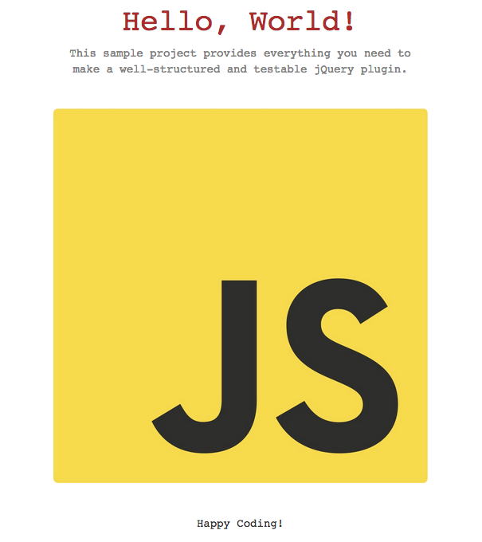

# jQuery Seed

### *Quickly create well-organized, testable plugins*

**by Ty-Lucas Kelley**

---

```bash
$ npm install -g jquery-seed
$ jqseed
```

This project is a skeleton for an organized and testable jQuery plugin.
It can be used to quickly bootstrap a plugin and development environment.

The project contains everything you need to instantly get started with
your jQuery plugin, get it tested, and make a demo.

The sample app provided demonstrates a trivial plugin,
which changes text to "Hello, World!" when called.

### What's New

* Minify on `npm start` (10/6/2014)
* Moved app to top-level directory so `git clone` is more effective (12/19/2014)
* Added to npm and made generator script (12/19/2014)
* Minor refactoring (12/19/2014)

### The Setup

Just clone this repository and install the dependencies:

**What you'll need**

1. [git](http://git-scm.com/)
2. [node.js](http://nodejs.org/)
3. [npm](https://www.npmjs.org/)

**Clone jquery-seed**

Use git for this part:

    $ mkdir my-project && cd my-project
    $ git clone http://github.com/tylucaskelley/jquery-seed

Or, you can use the generator script:

    $ npm install -g jquery-seed
    $ jqseed

The `jqseed` command will clone the repository for you.

**Node modules**

The included `package.json` file takes care of all the annoying stuff for you! All you need is:

    $ npm install

After that, assuming there were no problems, you'll have a new directory that looks like this:

    node_modules/
        bootstrap/
        chai/
        chai-webdriver/
        chromedriver/
        http-server/
        jquery/
        jshint/
        mocha/
        node-http-server/
        normalize.css/
        selenium-webdriver/

Not all of these modules are necessary, so if you don't need or want one, just run:

    $ npm uninstall <module> --save-dev

to remove it and update your `package.json` accordingly.

### Changing things

The nice part about this seed app is that everything is modular, thanks to `npm`:

* Don't like Chai? Use Assert instead.
* Don't like http-server? Write up your own using NodeJS.
* No need for Bootstrap? `npm uninstall bootstrap`.
* Want to use AngularJS and Protractor? Easy as 1, 2, `npm intsall`.

### Running the App

Everything is preconfigured for you (with a very simple development server), so just start things up with this:

    $ npm start

and go to http://localhost:3000 to see the sample project in action. It should look like this:



### Project Structure

    bin/                    --> Binary files
        generate                --> Project generator
    css/                    --> CSS stylesheets
        main.css                --> Sample CSS
    img/                    --> Images
        js.jpg                  --> Sample image
    index.html              --> Sample index page
    js/                     --> JavaScript source
        jquery.hello.js                --> Sample plugin's source code
    .gitignore              --> Files that git will ignore
    .travis.yml             --> Travis CI settings
    hello.jquery.json       --> jQuery package information
    package.json            --> NPM stuff: go here for jshint, dependencies, and app info
    README.md               --> This README
    LICENSE.txt             --> MIT License  
    test/                   --> All test source
        mocha.opts              --> Mocha config file
        spec/                   --> Test files
            tests.js                --> Sample e2e tests

### Testing

Testing your plugin is made easy thanks to JSHint, Chai, Mocha and Selenium-Webdriver. To run your tests in chrome, simply type:

    $ npm test

which will first run JSHint, based on the configuration set in `package.json`:

```json
    "jshintConfig": {
        "node": true,
        "unused": true,
        "undef": true,
        "globals": {
            "$": false,
            "jQuery": false
        }
    }
```

and then the end to end tests (written using the `selenium-webdriver/testing` module + `chai` and `chai-webdriver` for assertions).
You don't need to have a server running, as the included tests will take care of this.

You can configure Mocha to use different reporters, globals, and default timeouts by editing the `mocha.opts` file in `test/`, which looks like this by default:

    --reporter nyan
    --timeout 0

If you plan on running your plugin against CI, it might be helpful to use Mocha's xunit reporter and write to a file instead. Just change `npm test` in `package.json` to something like this:

    npm install && mocha test/spec/tests.js -R xunit | tee results.xml

The tests run in Chrome by default, but Firefox or another browser can be used, with some small additional setup:

* Download the selenium standalone server from [here](http://selenium-release.storage.googleapis.com/index.html) and run it using:

        $ java -jar /path/to/selenium-server-standalone-X.xx.x.jar

* Change your test code to use Firefox instead of Chrome:

        var driver = new webdriver.Builder().
            withCapabilities(webdriver.Capabilities.firefox()).
            build();

* Run your tests the same way: `npm test`.

###Publishing your plugin

This app is set up so that you are ready to publish to jQuery's website. The steps can be found [here](http://plugins.jquery.com/docs/publish/), but I'll go through the basics:

1. Making your plugin
    * Stick to the design principles laid out by the jQuery team in [this tutorial](http://learn.jquery.com/plugins/basic-plugin-creation/) and you'll be all set.
    * Make it useful! Be sure to browse the current repository of plugins first.
2. Adding a Service Hook
    * You need a GitHub account to do this: on the settings page for your repository, click the Webhooks & Services link, then click the Configure services button. Scroll down to find the jQuery Plugins service and enable it.
3. Adding the Manifest file
    * I've provided a sample file called `hello.jquery.json`; basically, it describes things like the name and description for yoor plugin, the homepage, and dependencies, etc.
    * You upload this file [here](http://plugins.jquery.com/docs/publish/#validate-your-manifest-file-here) to make sure everything is valid.
4. Tagging versions
    * This is the last step; simply `$ git tag x.x.x` (replace x's with your version number) and then do a `$ git push origin --tags` and the jQuery plugin site will take care of the rest.

If you run into any trouble or feel like you've been waiting too long for your plugin to finish publishing, check the [error logs](http://plugins.jquery.com/error.log)!
